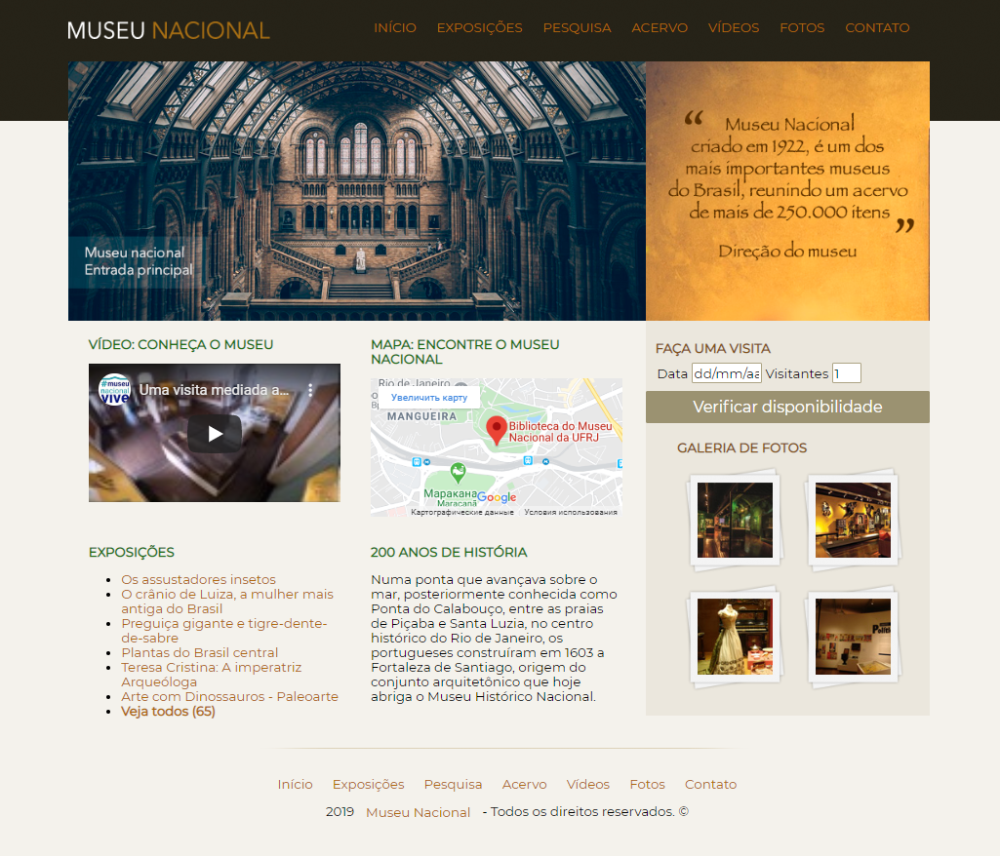

<h1 align="center">
    Museu Nacional
</h1>

<h1>

</h1>

# 📝 About

A project that I developed during December of 2019, creating a website for the National Museum located in Rio de Janeiro, Brazil

---

# 💻 Features 

This project was developed with:
- [HTML](https://developer.mozilla.org/en-US/docs/Web/HTML)
- [CSS](https://developer.mozilla.org/en-US/docs/Web/CSS)

---

<h3 align="center">
Created by João Paulo Autran 🚀
</h3>            